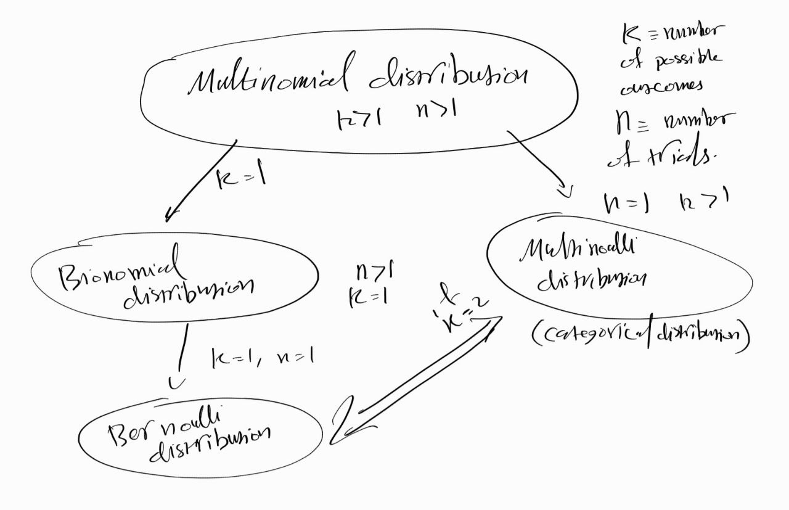

# ML Book by Murphy
## Chapter 2 probability 
### 2.1 What is porbability 
There are two views of a probability:
1. Frequentist view, which interprets probabilities as long term frequencies.
2. Bayesian view, which interprets probabilites as a quantification of our uncertainty about an event.
Examples
- If I flip a coin it will land head with 0.5 probability
	- Frequentist: It will land head half of the time (if we fliped many many times)
	- Bayesian: Landing head or tail is qually likely.
#### comment about the Bayesian view
It allow us to assign probabilities to events that do not happen many times or can not be done in trails becuase we do not have control over them, for example the probability of melting of the polar ice cap by 2020, or the probability of an email message to be a spam or not.
#### Discrete random variables
A random variable that takes its values from a finite set or a infintly countable set.
###### some useful properties and functions
- The Indicator function: a function that returns either zero or one dependeing on its input, if the input evaluate to true it will return one otherwise, it will return zero.
$I(x=1) = 1$ if $x=1$ otherwise $I = 0$.
- The porbability of a Union of two 
$P(A\cup B) = P(A) + P(B) -  P(A \cap B)$
If A and B are mutually exculsive (disjoint) then $P(A \cap B)=0$
- Product rule
$P(A,B) = P(A\mid B) P(B)$
- Marginal probability
$P(A) = \sum_b P(A,B) = \sum_b P(A\mid B) P(B)$
- Chain rule
$P(X_{1:D})=P(X_1)P(X_2\mid X_1)P(X_3 \mid X_2,X_1) \cdots  P(X_D \mid X_{1:D-1})$
- Conditional probabilities 
$P(A \mid B) = \frac{P(A,B)}{P(B)}$
- Bayes rule
$P(A \mid B) = \frac{P(B \mid A) P(A)}{P(B)}$
- conditional independence: if $X$ and $Y$ are conditional independent given $Z$ then $P(X,Y \mid Z) = P(X \mid Z)P(Y \mid Z)$, some of the applications of conditional independence are: Naive Bayes, Markov models, graphical model.
- Therom: If $X$ and $Y$ are conditional independent given $Z$ then $P(X,Y \mid Z) = h(x,z)g(y,z)$
#### Continuous random variables
For continuous random variables, we define the cumultive distrbution function (CDF), which defined as $F(X) = P(X \leq q)$, it is a monotonically increasing function and using it we can calulate of x to be in an interval $P(a \leq X \leq b)=F(b) - F(a)$
Now if $f(x) - \frac{dF}{dx}$ exists we call it the probability densoty function (PDF) $P(a \leq X \leq b) = \int_{a}^{b} f(x) dx$
##### Quantiles
Since $F$  a monotonically increasing function, it has an inverse $F^{-1}$, it will return $x_{\alpha}$ such that $P(X \leq x_{\alpha}) = \alpha$ and it is called the $\alpha$-quantile, if $\alpha = 0.5$ it is called the median and for $\alpha = 0.25$ and $\alpha = 0.75$ it is called the lower and upper quartiles.
One of its applications is compute the tail area probabilities.
#### Mean, Variance, and Standard devation
The mean or the expected value is defined as follows:
For discrete variables $\mu = E[X] = \sum_x p(x)x$ 
For continuous variables $\mu = E[X] = \int_x p(x)x dx$ 
And the variance is defined as 
$Var[X] = E[(X - \mu)^2] = E[X^2] - E[X]^2$
the standard devation is defined as $Std[X] = \sqrt{Var[X]}$
#### Common discerte distrbution
##### Bionomial and Bernoulli distrbution
The bionomial distribution describes binary-outcome trails that are performed n times. 
Let $X \in [0, \cdots, n]$ the number of successes (heads) in n trails (coin flips) and $\Theta$ is the probability of success (head), then write $x \sim Bin(k \mid n,\theta)$ if $Bin(n,\theta) = {n \choose k} \theta^k (1-\theta)^{n-k}$ where ${k \choose n} = \frac{n!}{(n-k)!k!}$ is the bionomial coffiecient. 
For the bionomial distribution: $\mu = \theta$ and $var = n\theta(1-\theta)$.
The bernoulli distrbution is a special case of the bionomial distrbution where $n=1$
We write $x \sim Ber(\theta)$ if $Ber(\theta) = \theta^{I(x=1)} (1-\theta)^{I(x=0)}$
#### Multinomial and Multinoulli distrbution
The multinomial distribution is a generalization of the bionomial distrbution where we have more than one two outcome.
Let $x \in R^K$ where $K$ is the number of outcome and $\vec{\theta} \in R^K$ be the a vector of probabilities where each entry represents the probability of a specific event.
Also, let $n$  be the total number of trails, so $\sum_{i}^{K}x_i = n$.
$X \sim Mu(x \mid n, \vec{\theta}) = {n \choose {n1, n2, \dot, n_k}} \Pi_{i=1}^K \theta_j^{x_j}$, where $\sum_{i}^K n_i=n$ and ${n \choose {n1, n2, \dot, n_k}}$ is the multinomial coefficient.
To make this more concrete this is an example.
For a 6 sided die, $K=6$ and we throw it 100 times so $n=100$,  assuming a fair die then $\vec{\theta}=[1/6 \ 1/6 \ 1/6 \ 1/6 \ 1/6 \ 1/6]^T$.

If n=1 then $x$is a one-hot vector (also called the dummy encoding), we can also think of $x$ as a categorical random variable  with $K$ states.
For example if K=3 then the states are  $[1 \ 0 \ 0], [0 \ 1 \ 0], [0 \ 0 \ 1]$
#### A summary of the relation between the Bionomial, Bernoulli distrbutions and the Multinomial, Multinoulli distrbutions
