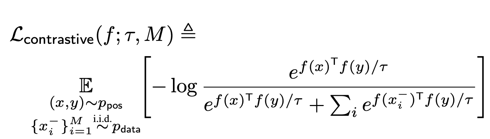
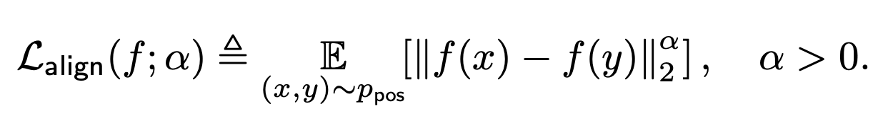
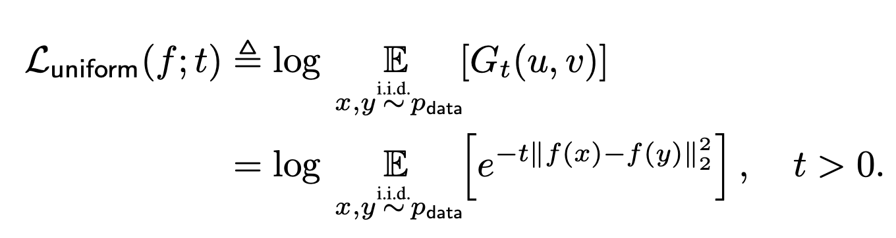
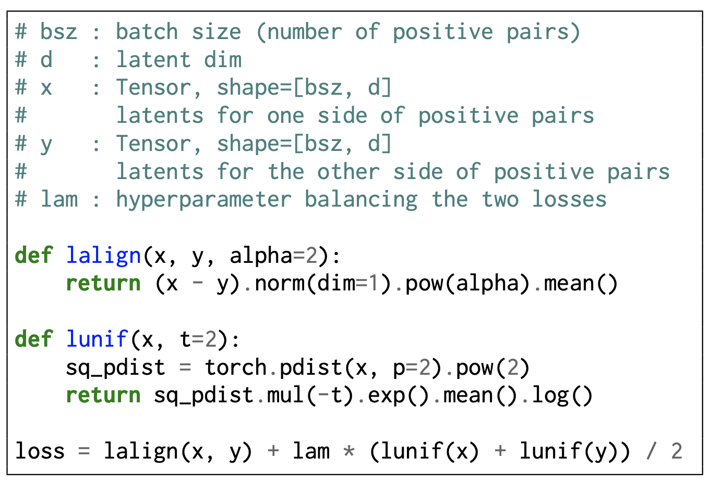

## Main Contributions
- Show that contrastive loss have two properties:
	1. Alignment of the positive pair in the normalized feature spcae.
	2. Uniformity of the learned features on the unit hypersphere.
- Introduce an optimizable metrics for each quantity.
- show that optimizing for those two metrics yeilds similar or better performance on downstream tasks tham contrastive loss.

## Alignment and Uniformity
Contrastive learning is a self-supervised learning method, the goal is learn similar features for similar inputs by maximizing the similarity between two augmented views of the same input and maximizing the dissimilarity among other inputs, we can also view it as a way to inject our prior knowdge as invarinces.
An example of this from computer vision is to maximize the agreemeted between two randomly augmnted views of the same image and maximixe the disagreement among other images.
The motiviation behined this paper is to understand what contrastive learning does and to understand the features learned by the  contrastive learning objective.
The paper starts with the observation that we always normalize the features during representation learning, which improves training stability.
With that observations the paper confines it analysis to the unit hypersphere.

### The InfoMax principle does not explain why contrastive learning works
Previous work has shown that the success of contrastive learning is due to the mutual information maximization, this line of work view the contrative loss as a lower bound on the mutual information, but optimizing for tighrer bounds most of the time yields worse downstream perofmance, hence, the InfoMax pricnicple is not the secret behind the success of contrastive learning.

### Decomposition of the contrsative loss
At a high level contrastive learning do two things:
	1. Make the features of similar inputs as close as possible.
	2. Push the features of other inputs away.
The paper define those two properties as:
	1. Alignment: two similar inputs should have two similar features.
	2. Uniformity: The features of other inputs should distrebuted uniformly on the unit hypersphere (since all features have a maximum norm of one)
The figure below illustrate these two properties
For example the features of the cat are close to each other while other features are distrbutred on the unit hypersphere.

## Assumptions and notation
For the a positive pair $x, y$  (similar inputs) we have the following assumptions
	1. Symmetry of the positive pairs distrbution $p_{pos}(x,y) = p_{pos}(y,x) \forall (x,y)$.
	2. Matching marginal, which basiclly means that if we intergare over all the data points on y I will get the data distrbution. $\forall x \int p_{pos}(x,y) dy = p_{data}(x)$ 
	The specific form of contrsative loss studied in the paper is the InfoNCE or the CPC loss.
	  
### Alignment loss
The intutive understanding of alignment says that similar inputs should have similar features, hence, it can be defined as the $l_2$ distance between the positive pairs.

### Uniformity loss
For the uniformity loss the authors chose the radial basis function for two desirable properties (a) it is empiraclly reasonable to estimate with mini-batches and (b) it converges to the uniform distrbution on the hypersphere in the limit.

## Asymptotics of the contrastive loss
There are some mathermatical details that I will not talk about (It will take me time to understand it), but the important idea is that as the number of negative samples approaches $\infty$ the contrastive loss can be decomposed to the $\mathcal{L}_{align}(f;\alpha)$  and $\mathcal{L}_{uniform}(f;t)$ 

### Coding the losses

## Insights and questions from the discussion section

